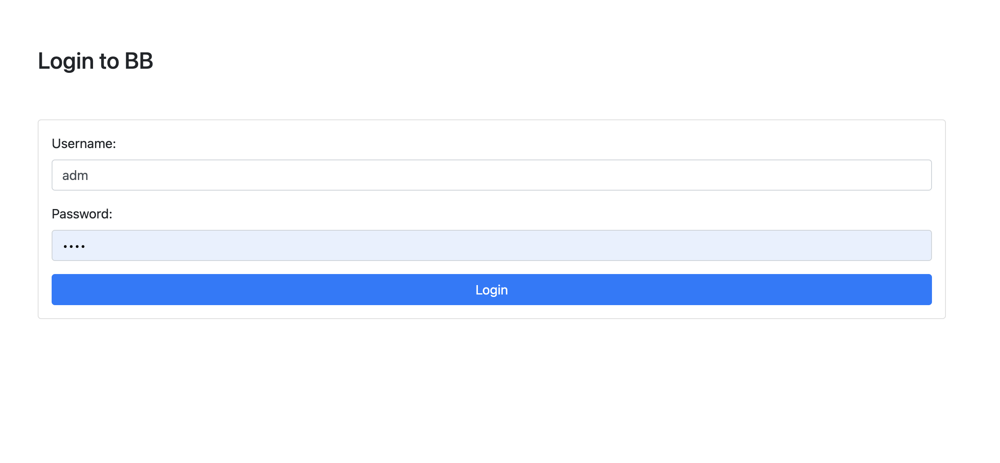
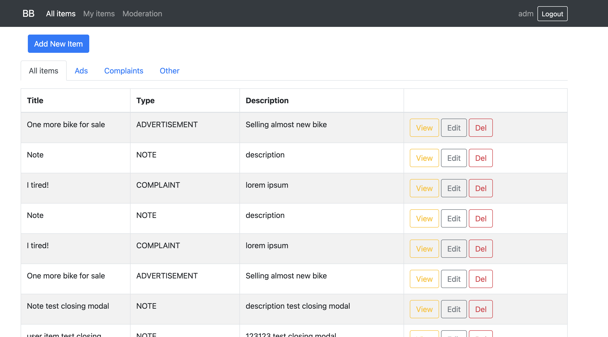
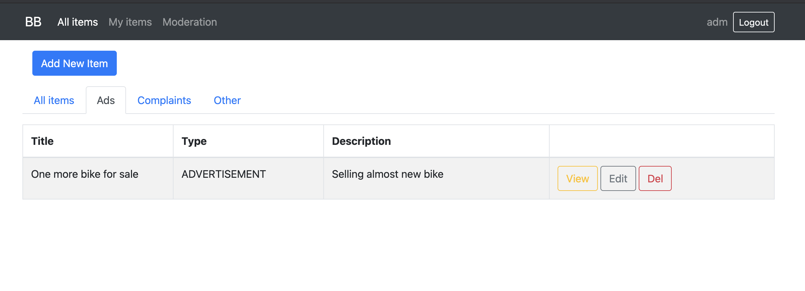
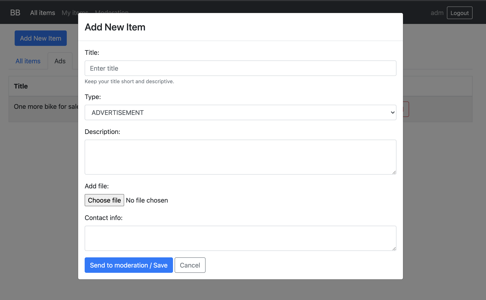
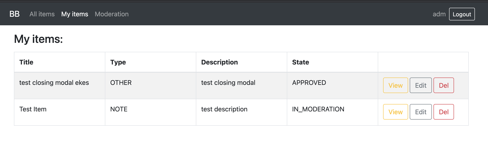
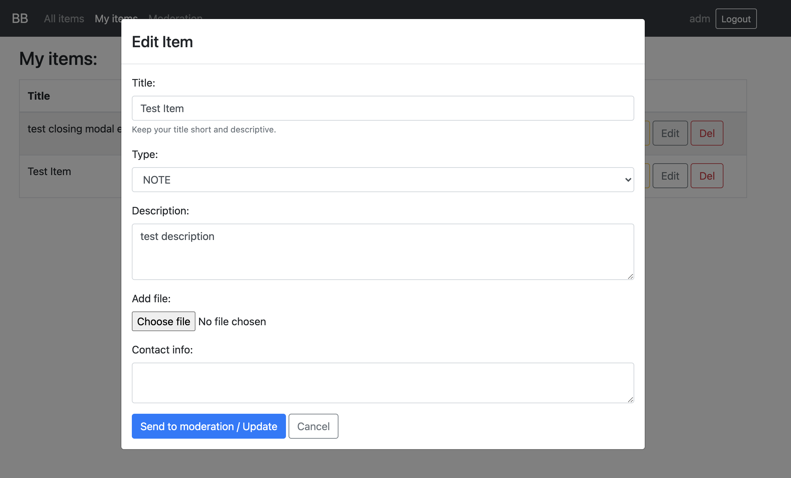
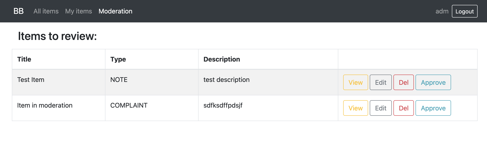
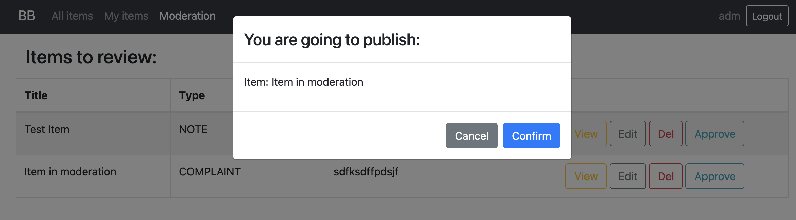

## Bulletin Board app: front-end part

Deployed to Heroku: https://bb-front-app.herokuapp.com

Credentials: 

| username | password | description |
| -------- | -------- | ----------- |
| user  | user  | can create items, see list of created items and their state, all approved items on home page available  |
| mod  | user  | moderator role, user + can see additional Moderation tab and Approve/Decline items |
| adm  | user | administrator role, moderator + Users tabs |

### My progress:

**4.5.2021**

Login page:

Home page (admin user):

Tabs for item types (admin user): 

 

Add new item modal (admin user):

My items view (admin user):

Edit item modal (admin user):

Moderation page (admin user):

Approve item modal (admin user):

